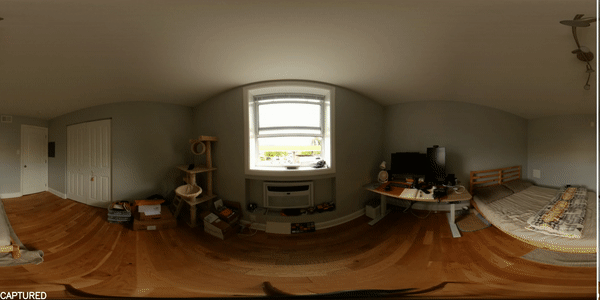

# Virtual Home Staging

This repository includes source code for the oral presentation paper ["Virtual Home Staging: Inverse Rendering and Editing an Indoor Panorama under Natural Illumination"](https://arxiv.org/abs/2311.12265) at the International Symposium on Visual Computing, Lake Tahoe, NV, Oct. 16-18, 2023.



## Indoor-Outdoor HDR Photography

See [HDR Calibration](https://github.com/bh2619-k/virtual-home-staging/tree/main/01_HDR_Calibration)

## Furniture Detection and Removal

See [Furniture Detection](https://github.com/bh2619-k/virtual-home-staging/tree/main/02_Furn_Detect)

See [Furniture Removal](https://github.com/bh2619-k/virtual-home-staging/tree/main/02_Furn_Removal)

## Rendering Preparation

See [Window Detection](https://github.com/bh2619-k/virtual-home-staging/tree/main/02_Win_Detection)

See [3D Layout](https://github.com/bh2619-k/virtual-home-staging/tree/main/03_3DFloor_Mesh)

See [Texture Preparation](https://github.com/bh2619-k/virtual-home-staging/tree/main/03_Reflectance_Tex)

See [Furniture Placement](https://github.com/bh2619-k/virtual-home-staging/tree/main/04_Furn_Layout)

## Virtual Staging

See [Rendering Pipeline](https://github.com/bh2619-k/virtual-home-staging/tree/main/05_Virtual_Render)

## BibTeX

```
@inproceedings{ji2023virtual,
  title={Virtual Home Staging: Inverse Rendering and Editing an Indoor Panorama under Natural Illumination},
  author={Ji, Guanzhou and Sawyer, Azadeh O and Narasimhan, Srinivasa G},
  booktitle={International Symposium on Visual Computing},
  pages={329--342},
  year={2023},
  organization={Springer}
}
```
